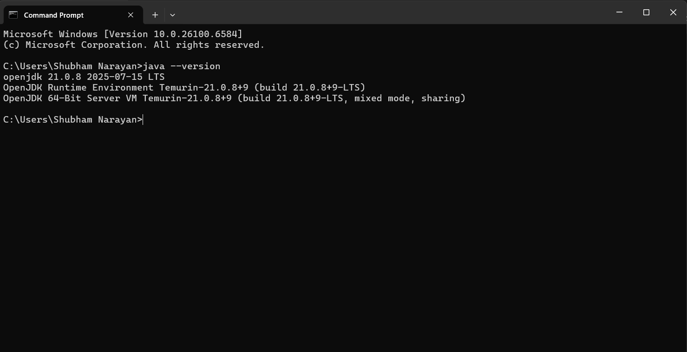
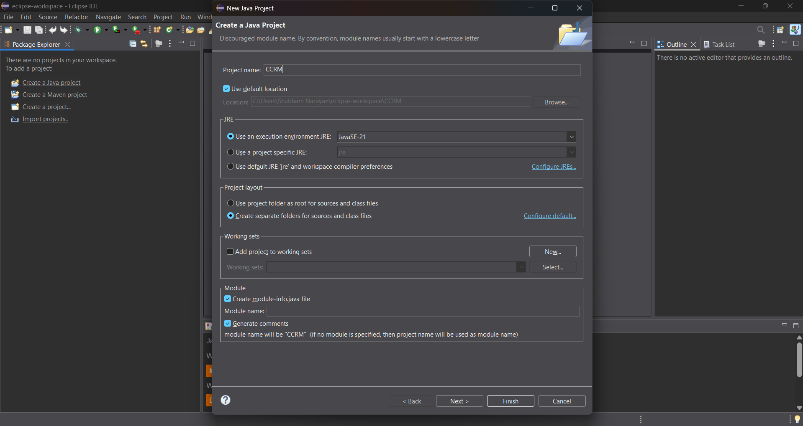
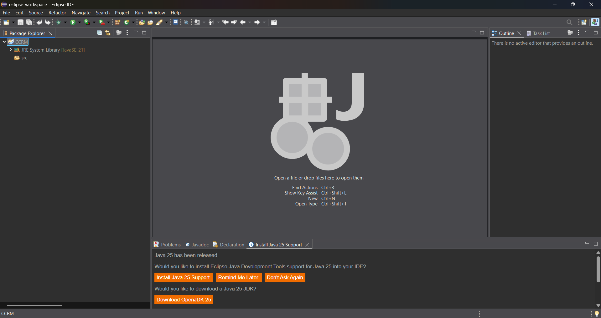

# 🎯 CCRM- Student Management System

> **A robust console-based application developed using Java SE to handle student records and course management, featuring advanced Java programming concepts and best practices.**

This comprehensive project demonstrates various Java capabilities, ranging from fundamental OOP concepts to advanced file handling operations, all integrated within a user-friendly command-line interface.

---

## 🌟 Project Description & Execution Guide

The application offers a complete academic management solution that enables users to:
- 📥 Load data from CSV files seamlessly
- 🎓 Register students for various courses
- 📊 Manage and track academic grades
- 🏆 Generate detailed academic transcripts with GPA calculations
- 🔄 Automatically create backup files with timestamps

### ⚙️ System Requirements
- **Java Development Kit (JDK) version 17 or higher** ☕

### 🚀 Getting Started

#### Compilation Process
Navigate to your project directory and run:
```bash
javac -d out -sourcepath src src/edu/ccrm/Main.java
```
*This command generates an `out` directory containing the compiled class files.*

#### Launching the Application
Once compilation is complete, start the program:
```bash
java -ea -cp out edu.ccrm.Main
```

<div align="center">


</div>

---

## 🔄 Java Development Timeline

### Major Releases and Innovations

| Release Year | Java Version | Significant Additions |
|--------------|--------------|----------------------|
| **1995** | Java 1.0 | 🌟 First release - Cross-platform compatibility |
| **2004** | Java 5 | 🎨 Generics, Enumerations, Metadata |
| **2014** | Java 8 | 🚀 Functional Programming, Streaming APIs |
| **2018-Now** | Contemporary Java | ⚡ Rapid release schedule, Long-term support |

*This project extensively leverages Stream APIs and Lambda functions introduced in Java 8!*

---

## 🔍 Java Platform Categories

### Exploring Different Java Editions

<table>
<tr>
<th>Edition</th>
<th>Primary Focus</th>
<th>Common Applications</th>
<th>Project Relevance</th>
</tr>
<tr>
<td><strong>Java SE</strong><br/>(Standard Edition)</td>
<td>🖥️ Desktop & Server Applications</td>
<td>Standalone programs, console utilities</td>
<td><strong>✅ Core foundation of this project</strong></td>
</tr>
<tr>
<td><strong>Java EE</strong><br/>(Enterprise Edition)</td>
<td>🌐 Enterprise Web Solutions</td>
<td>Large-scale business platforms</td>
<td>❌ Outside project scope</td>
</tr>
<tr>
<td><strong>Java ME</strong><br/>(Micro Edition)</td>
<td>📱 Embedded Systems/IoT</td>
<td>Limited-resource devices</td>
<td>❌ Not relevant here</td>
</tr>
</table>

---

## 🏛️ Java Platform Architecture: JDK, JRE & JVM

### The Java Technology Stack

```
┌─────────────────────────────────────┐
│        JDK (Development Kit)        │
│  ┌─────────────────────────────────┐│
│  │    JRE (Runtime Environment)    ││
│  │  ┌─────────────────────────────┐││
│  │  │  JVM (Virtual Machine Core) │││
│  │  │                             │││
│  │  └─────────────────────────────┘││
│  │  + Standard Libraries          ││
│  └─────────────────────────────────┘│
│  + Development Tools (javac, etc.) │
└─────────────────────────────────────┘
```

- **⚙️ JVM (Java Virtual Machine):** Core execution environment that interprets Java bytecode, ensuring cross-platform compatibility
- **🏃‍♂️ JRE (Java Runtime Environment):** Complete runtime package including JVM plus standard libraries for *executing* Java programs
- **🛠️ JDK (Java Development Kit):** Full development suite containing JRE plus compiler (`javac`) plus additional development utilities

---

## 🖥️ Windows Setup & Eclipse Configuration

### 🪟 Setting up JDK on Windows

#### Installation Walkthrough

1. **Obtain** the JDK installer from Oracle's official site or OpenJDK distributors
2. **Run** the `.exe` file and complete the installation wizard

   

3. **Setup System Variables:**
   - Create `JAVA_HOME` → `C:\Program Files\Java\jdk-21`
   - Modify `Path` → Include `%JAVA_HOME%\bin`

4. **Test Installation** using Command Line:
   ```cmd
   java -version
   javac -version
   ```

   

### 🌙 Eclipse IDE Configuration

#### Setting up Development Workspace

1. **Initialize Project:** Navigate to `File > New > Java Project`

   

2. **Project Configuration:**
   - Name: `CCRM-Project`
   - Select appropriate JRE version

   

3. **Complete Setup:** Press "Finish" button

   

4. **Organize Code Structure:** Right-click on `src` directory
   - `edu.ccrm.domain`
   - `edu.ccrm.cli`
   - `edu.ccrm.service`

   

5. **Create Java Files:** Right-click packages to add new classes

   

---

## 📖 Course Curriculum Implementation

### 📚 Complete Topic Coverage

<details>
<summary><strong>🏗️ Core Object-Oriented Programming</strong></summary>

| Programming Concept | Project Implementation | Code Location |
|-------------------|----------------------|---------------|
| **Class Inheritance & Abstract Classes** | `Student` class inherits from abstract `Person` | `domain/Student.java` ← `domain/Person.java` |
| **Runtime Polymorphism** | Abstract method `getDetails()` overriding | `Person` class family |
| **Data Encapsulation** | Private attributes with accessor methods | Throughout domain classes |

</details>

<details>
<summary><strong>🎨 Software Design Patterns</strong></summary>

| Design Pattern | Application | Code Implementation |
|----------------|-------------|-------------------|
| **Singleton Pattern** | Centralized configuration management | `service/AppConfig.java` |
| **Builder Pattern** | Structured object construction | `domain/Course.java` (inner Builder class) |

</details>

<details>
<summary><strong>🔧 Advanced Java Capabilities</strong></summary>

| Java Feature | Project Usage | Implementation Files |
|--------------|---------------|-------------------|
| **NIO.2 File APIs** | Advanced file handling operations | `io/DataImporter.java`, `io/BackupUtil.java` |
| **Stream API & Lambda Functions** | Functional data processing | `CourseService.java`, `DataImporter.java` |
| **Enhanced Enumerations** | Grade point system calculations | `domain/Grade.java` |
| **Modern Date/Time API** | Timestamp generation for backups | `io/BackupUtil.java` |

</details>

<details>
<summary><strong>🔍 Professional Programming Techniques</strong></summary>

| Programming Technique | Implementation Details | Location |
|---------------------|---------------------|----------|
| **Custom Exception Classes** | Specialized error handling mechanisms | `exception/StudentNotFoundException.java` |
| **Recursive Algorithms** | File system directory scanning | `calculateDirectorySize()` method in `BackupUtil.java` |
| **Runtime Assertions** | Input validation and contract checking | `Course.Builder` validation logic |

</details>

---

## ⚡ User Guide & Command Reference

### 🔧 Assertion Configuration
> **Note:** The `-ea` command line argument is **essential** for enabling assertion checks in the `Course.Builder` validation logic.

### 📋 Typical User Session

Here's a common workflow through the application features:

```
🚀 System Launch
├── 6️⃣ Load Data from CSV Files
├── 1️⃣ Display All Students (confirm import success)
├── 2️⃣ Display All Courses (verify course data)
├── 3️⃣ Register Student for Course
│   ├── Enter Student ID: S101
│   └── Enter Course Code: MA201
├── 5️⃣ Generate Student Transcript Report
└── 💾 Automated Backup File Generation
```

### 📁 Backup System Features

The system automatically generates timestamped backup archives:


---

## 🎯 Technical Highlights

- ✅ **Full Object-Oriented Design** with inheritance hierarchies and polymorphic behavior
- ✅ **Contemporary Java Features** utilizing Streams and functional programming concepts
- ✅ **Industry-Standard Design Patterns** (Singleton, Builder implementations)
- ✅ **Advanced File Operations** leveraging NIO.2 framework
- ✅ **Comprehensive Error Handling** with custom exception hierarchies
- ✅ **Intelligent Backup Management** featuring automatic timestamping
- ✅ **Complete Academic Data Management** for students and course catalogs
- ✅ **Sophisticated GPA Computation** with weighted grade point algorithms

---

<div align="center">

**Crafted with 💡 using Java SE | Showcasing Contemporary Development Methodologies**

</div>
